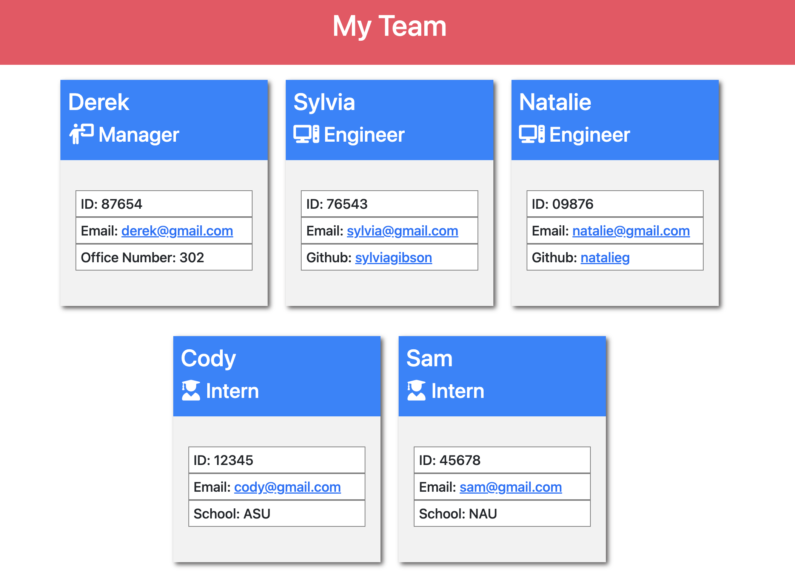

# Team Profile Generator

## Application Description
This is a node application which generates a HTML file from user input. A CSS style sheet is also automatically created to accompany it. In the terminal, by stating 'npm start' or 'node index.js' the user is first prompted which team member employee they would like to add info for to the HTML: Manager, Engineer, or Intern. After they select one from the list and answer the questions they are continually prompted to add more employees until they select 'Quit'. Upon quitting, the HTML and CSS file is generated.

## Challenge Description
The challenge required using node.js with the modules of inquirer, fs (filesystem), and jest. Inquirer enabled prompt functionality, fs enabled writing the HTML and copying the CSS style sheet, and jest enabled testing. Classes were used for the generic Employee as well as derivatives of this with specific Manager, Intern, and Engineer classes. Tests are available for each class. Each class has unique information that appears on their information card and is added to the HTML via an array. While all employees have name, ID, and email, the manager also has an office number, the intern has a school, and the engineer has a github.

## User Story

```
AS A manager
I WANT to generate a webpage that displays my team's basic info
SO THAT I have quick access to their emails and GitHub profiles
```

## Acceptance Criteria

```
GIVEN a command-line application that accepts user input
WHEN I am prompted for my team members and their information
THEN an HTML file is generated that displays a nicely formatted team roster based on user input
WHEN I click on an email address in the HTML
THEN my default email program opens and populates the TO field of the email with the address
WHEN I click on the GitHub username
THEN that GitHub profile opens in a new tab
WHEN I start the application
THEN I am prompted to enter the team manager’s name, employee ID, email address, and office number
WHEN I enter the team manager’s name, employee ID, email address, and office number
THEN I am presented with a menu with the option to add an engineer or an intern or to finish building my team
WHEN I select the engineer option
THEN I am prompted to enter the engineer’s name, ID, email, and GitHub username, and I am taken back to the menu
WHEN I select the intern option
THEN I am prompted to enter the intern’s name, ID, email, and school, and I am taken back to the menu
WHEN I decide to finish building my team
THEN I exit the application, and the HTML is generated
```

## Tasks Completed
The JavaScript documents include:
* functions, classes, constructors, objects, arrays
* node modules such as Inquirer, FS (file system), and Jest
* comments

The HTML documents include:
* proper HTML semantic labelling
* Font Awesome icons
* Bootstrap library for the grid layout
* comments

The CSS documents include:
* an organized structure that matches the HTML order
* element and class selectors

## Languages
- JavaScript
- HTML
- CSS

## Links
* [Screen Recording of Application](https://drive.google.com/...)

* [Repository](https://github.com/villettec/M10C-Team_Profile_Generator)

## Screenshots



## Credit
Villette Comfort

villette@live.com